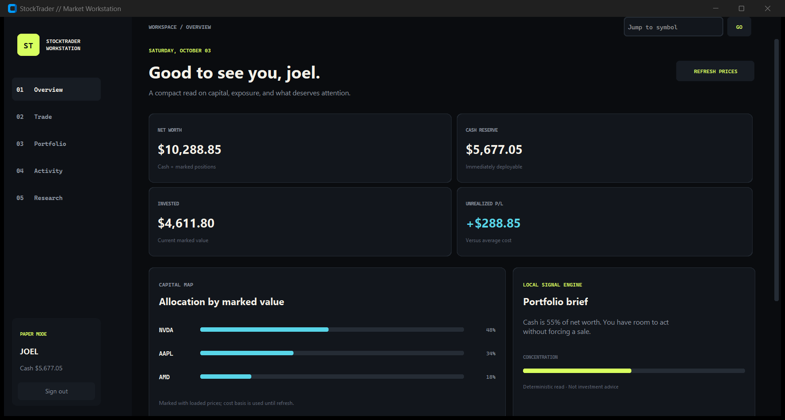
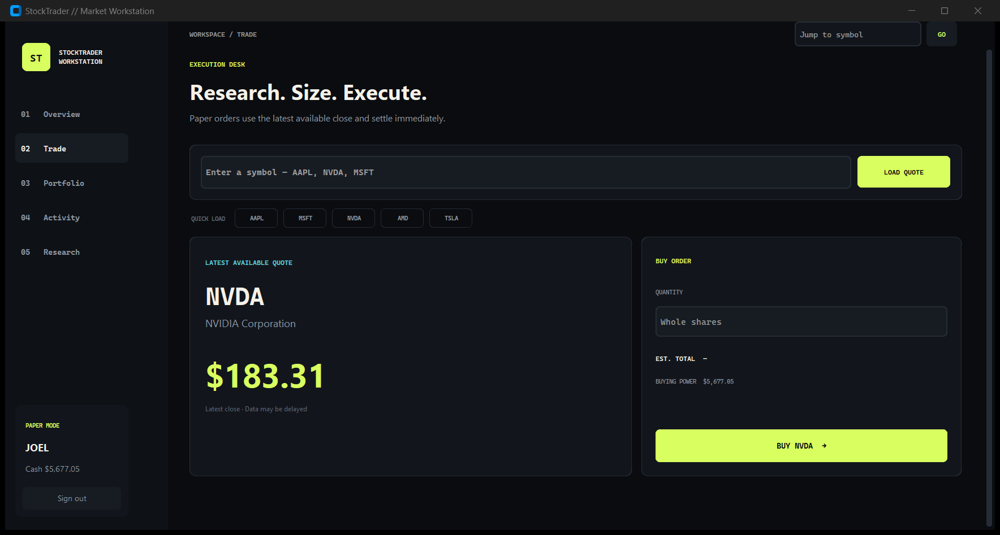
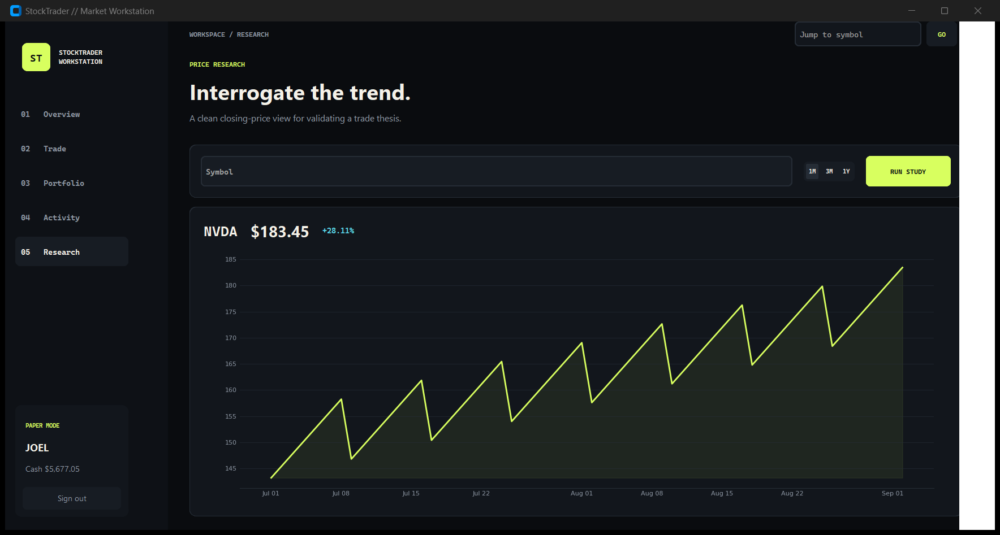

# StockTrader — Market Workstation Rebuild

StockTrader has been completely redesigned as a focused desktop paper-trading workstation. The rebuild keeps the virtual investing concept while replacing the interface, trading flow, data layer, and account security.



## Install

StockTrader requires Python 3.9 or newer and an internet connection for market data.

```powershell
git clone https://github.com/JoelObinnaEze/StockTrader.git
cd StockTrader
python -m venv .venv
.\.venv\Scripts\Activate.ps1
python -m pip install -r requirements.txt
```

On macOS or Linux, activate the environment with `source .venv/bin/activate` instead.

## Run

```powershell
python gui.py
```

Create an account to start with $10,000 in virtual cash. The application creates a private, ignored SQLite database on first launch; market quotes may be delayed.

## New workstation experience

- Persistent sidebar navigation across Overview, Trade, Portfolio, Activity, and Research
- Dark, high-contrast interface inspired by professional market terminals
- Responsive layouts with clear loading, empty, success, and error states
- Background market-data requests that keep the application responsive
- Fast symbol lookup and shortcut access to frequently watched stocks

## Portfolio intelligence

- Live net worth, available cash, invested capital, and unrealized profit or loss
- Position-level market value, allocation, average cost, and performance
- Capital-allocation visualization and concentration tracking
- Deterministic portfolio briefs that summarize exposure without presenting financial advice
- Historical price research with one-month, three-month, and one-year studies

## Trading engine upgrades

- Guarded whole-share paper orders with quantity and buying-power validation
- Atomic cash, position, and transaction updates
- Correct weighted-average cost calculations across repeated purchases
- Validated sell orders that cannot alter an account when rejected
- Reverse-chronological execution ledger for completed trades

## Security and reliability

- Scrypt password hashing with unique salts
- Strict username, password, symbol, price, and order-size validation
- Parameterized SQLite queries throughout the account and trading paths
- A single validated yfinance boundary for quote and history data
- Recoverable handling for unavailable, invalid, or non-finite market data
- Private runtime databases, credentials, and generated artifacts excluded from version control

## Interface

| Execution desk | Price research |
|---|---|
|  |  |

## Quality coverage

- 11 focused tests covering authentication, database initialization, trade invariants, market-data normalization, and portfolio analysis
- Successful compilation, dependency, live-quote, authentication-window, and signed-in workspace checks
